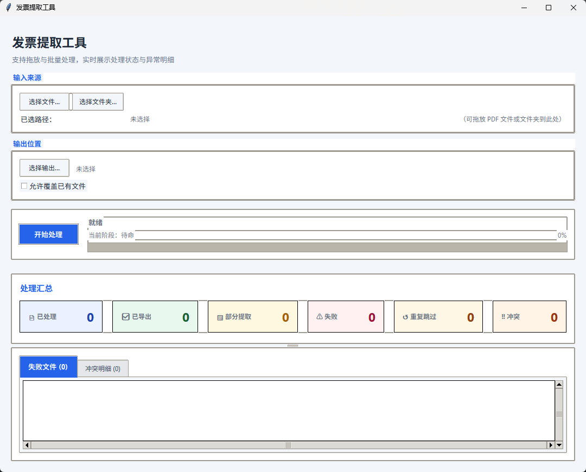
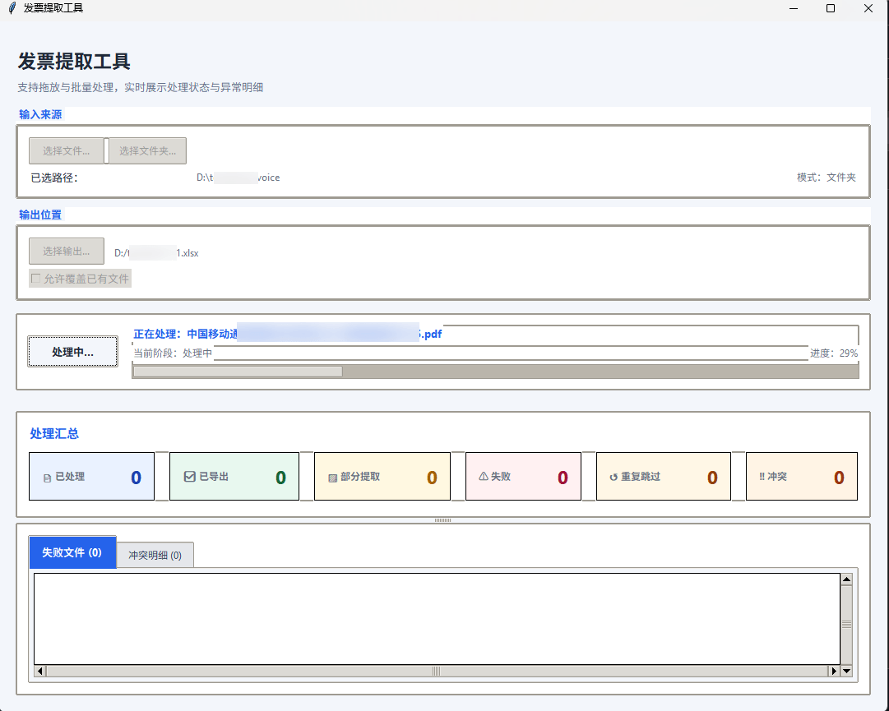
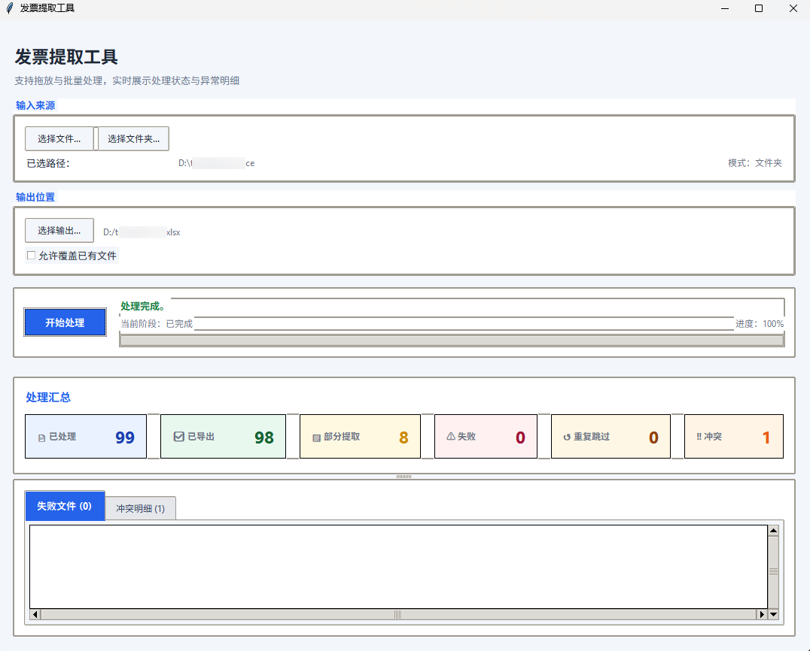

# Invoice Tool

[简体中文](./README.zh-CN.md)

Extract structured data from text-based PDF invoices and export aggregated results to Excel. The project provides both a command-line interface for batch processing and a drag-and-drop desktop GUI for everyday use.

## Features

- Extract invoice fields from text-based PDF files
- Export normalized results to `.xlsx` with `openpyxl`
- Batch-process a single PDF or an entire folder
- Use the CLI for automation workflows
- Use the Tkinter GUI with drag-and-drop support for manual operation
- Package the GUI as a Windows executable with PyInstaller

## Requirements

- Python 3.8+
- A text-based PDF invoice source

## Installation

```bash
pip install -r requirements.txt
```

Current runtime dependencies:

- `pdfplumber`
- `openpyxl`
- `tkinterdnd2`

## Usage

This project provides both CLI and GUI entrypoints.

### CLI

Run the command-line tool:

```bash
python -m invoice_tool.cli --input <input_path> --output <output_path> [--overwrite]
```

Example:

```bash
python -m invoice_tool.cli --input ./samples --output ./out/invoices.xlsx --overwrite
```

Parameters:

- `--input`: Path to a single PDF file or a directory containing PDF files
- `--output`: Path to the output Excel workbook
- `--overwrite`: Overwrite the output file if it already exists

### GUI

Launch the desktop application:

```bash
python -m invoice_tool.gui
```

GUI highlights:

- Drag and drop one PDF file or one folder at a time
- Browse for input and output paths from the interface
- Track progress and processing status in real time
- Review failed files and duplicate conflicts inside the app

#### GUI preview

Initial screen:



Processing state:



Completed state:



#### Exported Excel preview

Example of the generated workbook:


## Build a Windows EXE

This repository includes a PyInstaller-based Windows packaging setup.

Run:

```bat
build_exe.bat
```

After a successful build, the GUI executable is generated at:

```text
dist\InvoiceTool\InvoiceTool.exe
```

To build a Windows 7/8 compatibility-targeted package with Python 3.8, run:

```bat
build_exe_legacy_win7_8.bat
```

That legacy-compatible output is generated at:

```text
dist-win7-8\InvoiceTool\InvoiceTool.exe
```

Notes:

- The build is based on the GUI entrypoint only
- `InvoiceTool.spec` explicitly collects `tkinterdnd2` resources
- The build script recreates `.venv-build` to keep packaging isolated
- Distribute the full `dist\InvoiceTool\` folder, not only the `.exe`

### Windows compatibility notes

The packaged executable is built with the local Python interpreter used by `build_exe.bat`.

- **Current packaged build target**: Windows 10 / Windows 11
- **Likely unsupported by the current package**: Windows 7 / Windows 8 / Windows 8.1
- If a recipient sees an error like `api-ms-win-core-path-l1-1-0.dll` missing, the target machine is usually too old for the Python runtime used to build the package, or it is missing required modern Windows runtime components.

For recipient machines, check the following first:

1. Use Windows 10 or Windows 11 with current system updates.
2. Install **Microsoft Visual C++ Redistributable 2015-2022 (x64)**.
3. Launch `dist\InvoiceTool\InvoiceTool.exe` from the unpacked folder.

### If you need a legacy Windows-compatible package

If you must support Windows 7/8/8.1, do **not** build with Python 3.14.

- Use **Python 3.8.x** as the packaging interpreter.
- Ideally build on the oldest Windows version you want to support, or in a matching VM.
- Run `build_exe_legacy_win7_8.bat` to build the legacy-targeted package with `py -3.8`.
- The resulting folder to distribute is `dist-win7-8\InvoiceTool\`.
- The legacy build uses `requirements-legacy-win7-8.txt` to keep core binary dependencies within a Windows 7/8 friendlier range.

## Project Structure

```text
invoice_tool/
├─ application/      # Application orchestration
├─ cli/              # Command-line entrypoint
├─ domain/           # Domain models
├─ gui/              # Tkinter desktop interface
└─ infrastructure/   # PDF and Excel adapters
```

## Limitations

- The extractor targets text-based PDFs rather than scanned image-only documents
- The current GUI accepts one dropped item at a time
- The project is optimized around Chinese invoice export fields

## License

Choose an open-source license before publishing to GitHub, for example MIT or Apache-2.0.
